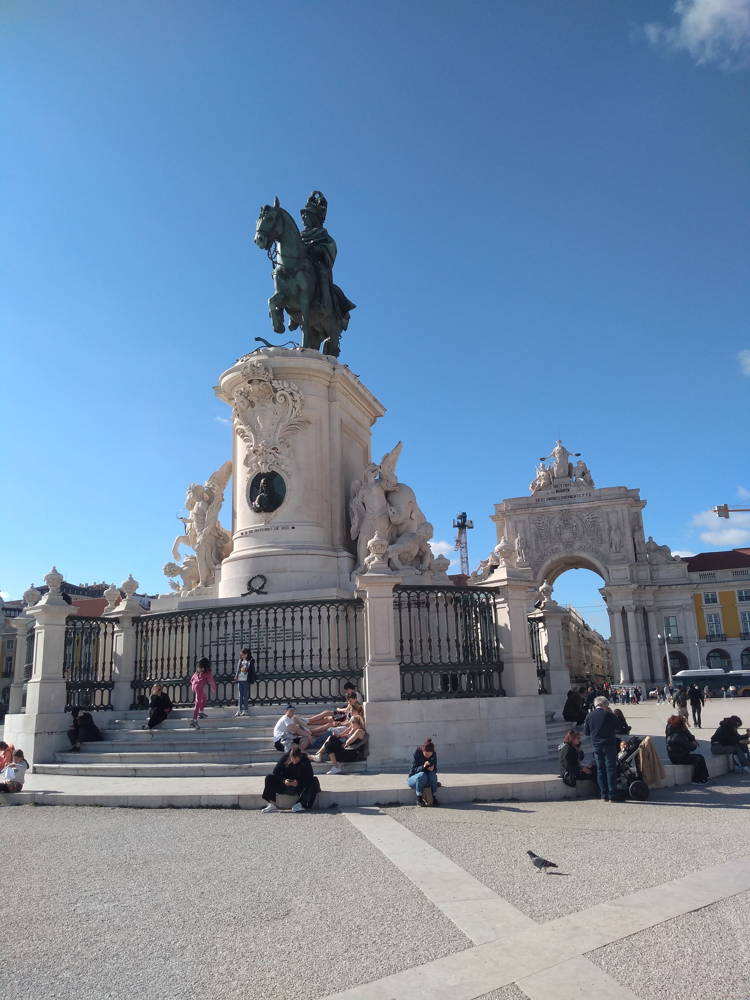

# imgtotext

```
                                                                                
                                                                                
                                                                                
                                                                                
                                                                                
                                                                                
                                                                                
                                                                                
                                                                                
                                                                                
                                 z_                                             
                            pP. j"W                                             
                           7   'j.(                                             
                           \_y  ^  `                                            
                            ^&     V                                            
                             R     l                                            
                            ."      ^.                                          
                            U h L    L                                          
                           ,_ __L , r                                           
                         _>@T`"^Y_%.h                                           
                       ,<N@Jj___   J?L                                          
                       * gJ  HN<      D,                                        
                         K ` , E     `  h                                       
                         @-4  >=^      -                                        
                         P&w_J            x                j                    
                         U`G-k_         ,                g{IjT.                 
                    , c  K7^~ ,         l .             ,BH,p= ,_               
                    ".   KL#' '      -_  _            -~?=+R<rm__-  _       ___ 
                   >]  ` L S.            \      qp, +U*`rj,^.`g_    (       TV^`
                   d^p   bM^"^``     t ,L`      @g`  J L ^5S`4H` . ,".          
                  ( _   ._''`TT   ..   N4 .     *N _yy g  +=  *,      `\_, -~~^M
     x.          +/^  j]   ,          _A,,  u~ \_N_ZDP_F*   -=><       _   ,  wa
   =gD{^>r*e>,7,_ 9o>*r  _[<,     __ qW   __zttzt7ZEEc~~ixM     +rz"      -L   =
 T}w<      AkT __,,..-~~=:g,-T[-F+H<: Qp  {!\.]|[L@DY#L _BZ+#e~~3.-    .   rj  T
__`B~  qw#xrL =pd2&j~]] h_)qj|__LL M   L  J H  J]Mkp] l k@L  7S,       =   ]B  n
   @   3M|JRr 'MH|H|M.|=NM+QjTrFPKL    t  J q qJ'F&MD-  Jql   "1#~~   ^R- [ *  "
 JqI]  R HjH_ ;MM[j[d'*+Ryy[^|/rCFL__ _&  . MwWU4lU`_    Wl   .  L     L  __    
 _g6' JmW>WM` `VNN{[WR   DlJ]|77+r+>  qL       ^^qw)     |      g@D__ _[#t^^^^^f
, f    J__H_  -'* [LM. __||_j}[}@@@\L_ML   .   =---~~+   '  ) ,_WQN@LBWq-` &-h~+
|=f    "r*' ,  .  `.,k< -R~~~~4-,=#gMNM                       7``'\.   .'rR  .- 
_           '^ ^* ^^^"`T Z,ZLRp-*._M<P^                           -C_  ` "T^"  A
/),j       ==-----~~+      :<:A_ &G ^"      rL.            7`     N}K  '        
#S IZ3^FFTT"TTTTTT"TT7""^ "``'`` [LL\,, . ._qP..........,  _.      =l  ^        
T\(..,.                     L,'`  w..      =1           `          ^    ,.2+=w+&
e+wgw+~gwawAww,u,,,,,Lg,,g_,2[,p_____ =-,,w+>#= ..:p~p=z ** ^^TT*ttM@Hr++e====.+
jK]XT#9MR9Kp@QVMQN#@M@BB@98RMR##NNQ@W&_   *W@gg@@@Z@kgpyw@t,jzj_-_,_____jw*4M4'^
W$@M@@WB@B@Q&BNWWM8WM@MMMR@WgMAW@DMBM@By_    MR#$8@BW8gW@WMMW8NMgWBMMR@MWkRWWyBk
MM@@M#MRg@@Q@NMQ#QWM@WW@N@M@M@N@NNN@@W#@@N_    "KBMBBMNW1*AgHWW#B@NWNN@MWB@@w#"^
9M@N@N@NBBNWNMBgB@&@#@@@WW@M@NB@RNN@MN@Mm@Rg_     "N@@B@gBBWMW@AgWR@M@NWF`      
RMKNWNMN@MMMN@NMNBBMBMW@NM@M@@NRWNNMQMB@M@BBMy  -    M@@@pB#MWWWWMT^`      __,<p
BNMM@@@MBNW@@@Nb@@BWWWBWWWQMMW@NB@MB@@WB@@@@W@Bg       ^4@B4P^`       __ag@M#EBN
MMMQ@N@BgN@QMWM@WMBWMBWM@NN@AWB@WNBWRNB&QWMI@@#@Bg_              __gpBB#NBWM#@@@
@@@@8@NMNWM@@@@@@MM@MNNWBN&@NN@@B@N8@MB@@@WNWBW@#f^           ,@W@@MMN@#WW@N#D@@
MND@B@WMWR@NMM@NMNBWM@NQ@B@MN@NRM@MQWWB@WWNP^`                 `WM@@NNNMQ@RB@ARR
d@B#@@W@@WNNMWMNBMBM@@@MMMBMN8RBMMN#BM*`           _,agy          "MDMWWM8NXBR#0
```


imgtotext is a command line tool to convert an image into text art. This has been done before, but the only method I've seen used before is a simple darkness method: a set of around 10 characters are chosen, representing a spectrum from lightest to darkest. Then the image is broken into cells, the brightness is averaged over that cell, and the cooresponding character is chosen based on that value. I think we can do better.

First I tried choosing the character closest to a given cell of the image using cosine similarity. Later I switched to least squares similarity. You can see both methods by looking at older commits in this repo. The above example used commit b266.
